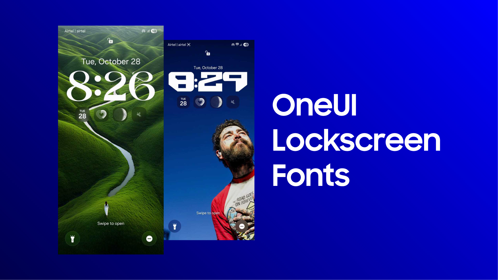

# Custom Font Installation for Samsung Galaxy Devices

A step-by-step guide to install custom fonts on Samsung Galaxy devices running OneUI 8 using APK Editor Studio.

## ⚠️ Important Notes

- **Tested on OneUI 8** - This method may not work with newer or older OneUI versions
- **Lock Screen Only** - Custom fonts installed this way can only be applied to the lock screen
- **System Font Limitation** - Samsung's OneUI restricts system-wide font changes to fonts from the official Galaxy Store font app. Attempting to apply custom fonts from Settings → Display → Font size and style will not work

## 📋 Prerequisites

- [APK Editor Studio](https://qwertycube.com/apk-editor-studio/) installed on your computer
- The `template_font.apk` file from this repository
- Your desired font in `.ttf` format (if you have `.otf`, use an online OTF to TTF converter)
- A code editor (Notepad++, VS Code, or any text editor)

## 🚀 Installation Steps

### Step 1: Prepare Your Font
1. Download your desired font in `.ttf` format
2. If your font is in `.otf` format, convert it to `.ttf` using an online converter
3. Note the exact filename of your font (e.g., `MyCustomFont.ttf`)

### Step 2: Open APK Editor Studio
1. Launch **APK Editor Studio**
2. Go to **File → Open APK**
3. Select `template_font.apk` from this repository
4. Click **Open Contents** to access the APK structure

### Step 3: Replace the Font File
1. Navigate to `assets/fonts/` folder in the APK structure
2. Note the name of the existing font file in this folder
3. Copy your new `.ttf` font file and paste it into the `assets/fonts/` folder
4. Rename your new font file to match the exact name of the old font file
5. Delete the old font file

### Step 4: Update the Manifest
1. Go back to the root directory of the APK (click back twice in the file browser)
2. Locate and open `AndroidManifest.xml`
3. Open it with a code editor
4. Find all instances of `rename_template` 
5. Replace every instance with the original name of your new font (without the `.ttf` extension)
6. Save the `AndroidManifest.xml` file

### Step 5: Build and Export
1. Close the file editor
2. In APK Editor Studio, go to **File → Save APK**
3. Choose a destination folder and save the modified APK

### Step 6: Install on Your Phone
1. Transfer the modified APK to your Samsung Galaxy device
2. Install the APK (you may need to allow installation from unknown sources)
3. Once installed, the font will be available in your device

### Step 7: Apply the Font
1. Go to your **Lock Screen**
2. Long press or access **Lock Screen customization**
3. Tap on **Font and Color**
4. Scroll all the way to the right
5. Tap on the **three dots (⋮)** menu
6. Your custom font will appear in the list
7. Select and apply it to your lock screen clock

## 📁 Repository Contents

- `template_font.apk` - Template APK file for font modification
- `samsung_custom_font_installer_lockscreen_fonts.jpg` - Screenshot showcase of custom font applied
- `README.md` - This guide

## 🐛 Troubleshooting

- **Installation Failed**: Ensure you've correctly renamed the font file and updated all instances in AndroidManifest.xml
- **Font Not Showing**: Make sure the font is in `.ttf` format and properly placed in `assets/fonts/`
- **Can't Apply to System**: This is expected behavior - custom fonts only work on the lock screen

## 📝 License

This project is for educational purposes. Ensure you have the right to use any fonts you install.

## 🤝 Contributing

Feel free to open issues or submit pull requests if you have improvements or find bugs!

---

**Disclaimer**: Modifying APK files may void warranties. Use at your own risk.